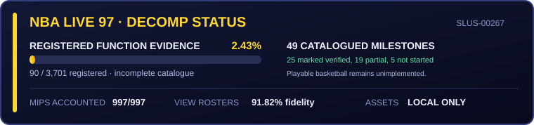

# NBA Live 97 PS1 decompilation

An experimental, native C/C++ reconstruction of the US PlayStation release of
NBA Live 97 (`SLUS-00267`). Original behavior is recovered using disassembly,
Ghidra, private static-recompilation evidence, and original-game comparisons.
The application runs native code; it does not run an emulator or a generated
recompilation runtime.

**You can explore a substantial Windows frontend, but you cannot play a
basketball match yet.** Exhibition Team Select and User Setup reach a partial
match snapshot; they do not launch a court. There is no complete possession,
CPU-versus-CPU or user-versus-CPU match, season/playoff progression, or match
save/load path.

[](docs/progress.md)

Neither panel is a game-completion percentage. The gold figure counts entries
in an **incomplete function-evidence catalogue**, which has not caught up with
the newer recovered modules. The green panel counts unequal, manually tracked
milestones. A source-accounted routine or passing test does not establish a
working game feature. See [current implementation status](docs/native_port_status.md)
for the distinction between playable frontend paths, tested subsystems, and
remaining work.

## Current scope

With your own extracted assets, the native Windows application provides:

- the loading, legal, intro-movie, title, and Game Setup sequence;
- Rules and Options, including persistent settings;
- local user-profile creation, editing, deletion, and versioned saves;
- the Rosters frontend, team browsing, player statistics, portraits, and Cool
  Fact playback;
- Re-order selection, Help/View/Compare, durable saves/discard and Reset
  ([implementation and limits](docs/reorder_rosters_workflow.md));
- Trade Players: two-team lists, swaps/transfers, Help/View/Compare and local
  saves/discard/Reset ([verification and remaining work](docs/trade_rosters_workflow.md));
- Sign Free Agent: 100-slot source list, destination validation, signing and
  local saves ([bounded accounting and tests](docs/sign_free_agent_progress.md));
- Release Players: releases, refusals, Help/View/Compare and local saves
  ([implementation and acceptance](docs/release_players_progress.md));
- Create Player: 40-slot durable catalogue, manager/Edit/New/Delete flow,
  32-field editor, recovered name/College/scroll timing, and a local-only
  ZDOM/ZFEMOCAP articulated preview ([status and remaining work](docs/create_player_progress.md));
- Exhibition Team Select and User Setup, including profile/control editing
  and a bounded accepted-match snapshot
  ([handoff boundary](docs/team_select_workflow.md));
- a five-track frontend music bank, menu sounds and Cool Fact speech through
  native audio output ([playback limits](docs/music_playback_workflow.md)); and
- a CLI trace describing recovered states, assets, audio, and transitions.

These paths still have scoped fidelity and integration limits. Created-player
roster insertion, injuries management, special-team match setup, deeper menu
paths, and original memory-card behavior remain incomplete. Local saves are
native formats, not a claim of PS1 memory-card compatibility.

Separate recovered modules and native tests cover portions of match startup,
lineups/controllers, player animation/input/physics, tip contact and ball release,
court packet construction, render-resource ownership, and sound initialization,
sample transfers, interrupts and events. Many are
compiled into the application but are **not connected to its live game loop**.
The newer audio startup tests do not replace the current host playback path or
prove natural startup, real hardware timing, synthesis, or full-match audio.

The newer [tipoff continuation](docs/game_tipoff_phase_workflow.md) and
[ball-release owner](docs/game_ball_release_workflow.md) compose in source
comparisons, ending with a loose ball in phase `82`, not completed possession.
The [court pass](docs/game_court_packets_workflow.md) calculates projected
coordinates and builds draw packets using native integer geometry. Its flat and
textured test packets now reach a [native pixel renderer](docs/game_packet_renderer_workflow.md).
The [actor-root owner](docs/game_player_root_workflow.md) composes with the
[player part-matrix owner](docs/game_player_geometry_workflow.md) to produce hand
endpoints under supplied camera/pose conditions. The
[body-projection owner](docs/game_player_projection_workflow.md) produces player
draw packets from those matrices and normalized body data. The complete
[player pass](docs/game_player_frame_workflow.md) now composes these owners with
shadows and off-screen indicators. The recovered
[camera/controller path](docs/game_camera_workflow.md) produces camera state
under explicit inputs; timing, pad/device and monitor effects still require
real providers. The bounded
[court-texture loop](docs/game_court_textures_workflow.md) now uploads actual
private XATL image data into retained VRAM. The separate
[court-resource tail](docs/game_court_resources_workflow.md) normalizes loaded
court data and prepares edge storage using the recovered allocator; neither
slice implements the full court loader. These components are not yet connected
into a live court or playable frame. Diagnostic court images use fixture camera
and ordering state, with no live actors; they are **not gameplay captures**.

Recovered game behavior is moving into portable C modules under
`src/recovered/`. C++ owns native resources, adapters and the Win32 frontend,
including rendering, input, movies and audio devices. Recovery and integration
are separate steps: a newly tested C owner is not automatically a live host path.

Confirmed original bugs are preserved and commented with their source owner;
see the [preserved behavior index](docs/preserved_original_bugs.md). Defects
introduced by the native port are still fixed.

## Assets and legal notice

**No game assets are included.** You must provide your own lawfully obtained
copy. The disc image, executables, overlays, decoded images, audio, fonts,
roster data, emulator dumps, and generated recompilation output must remain
under the ignored `.local/` directory.

The [MIT License](LICENSE) covers only project-authored source and
documentation. It grants no rights to NBA Live 97 or third-party intellectual
property. See [ASSET_NOTICE.md](ASSET_NOTICE.md) for the complete notice.

## Build and run on Windows

Requirements:

- Windows with Visual Studio 2022 and its C++/CMake tools (the build script
  currently uses the Community edition's default installation path);
- PowerShell 7 (`pwsh`), Python 3, and the private asset tools described below; and
- a matching `SLUS-00267` BIN image at
  `.local/input/nba-live-97-slus-00267.bin`.

The asset scripts also require EA Graphics Manager at
`.local/tools/EA-Graphics-Manager`, its Python dependencies (including Pillow
and reversebox), and Java for intro preparation. The intro script downloads and
hash-checks jPSXdec when missing. These are asset-preparation dependencies, not
an emulator runtime bundled with the port.

From PowerShell in the repository root:

```powershell
pwsh -File scripts/extract_assetpacks.ps1
python tools/extract_team_select.py
python tools/extract_user_setup.py
python tools/extract_match_setup.py
pwsh -File scripts/prepare_intro_movie.ps1
pwsh -File scripts/build.ps1
pwsh -File scripts/run.ps1
```

The three additional extractors prepare Team Select, User Setup and the
accepted-match data; they are not yet called by `extract_assetpacks.ps1`.
Asset extraction and movie preparation write only beneath `.local/`. The
normal build and desktop shortcut use the optimized
`build-windows/RelWithDebInfo/nba97_boot_decomp.exe`; its runtime trace is
mirrored to `.local/logs/boot_decomp_trace.log`. Verification scripts explicitly
build the complete Debug target set. For a manual Debug build, run
`scripts/build.ps1 -Configuration Debug -AllTargets`.
Optional: `pwsh -File scripts/create_desktop_shortcut.ps1` creates a shortcut
and requires Windows Terminal (`wt.exe`).

`scripts/build_wsl.ps1` builds the separate SDL2 compatibility application in
WSL Ubuntu with CMake, Ninja and SDL2 installed. It does not have Windows
frontend feature parity. GitHub CI builds the asset-free test targets, not the
full SDL or Windows frontend.

## Tests without game assets

The recovered logic and native adapter tests use synthetic fixtures. They need
CMake 3.20+ and C99/C++17 compilers, but no disc image, asset tools, SDL2 or
emulator. From a shell with CMake and the compiler available:

```sh
cmake -S . -B build-core -DNBA97_RECOVERED_TESTS_ONLY=ON
cmake --build build-core --config Debug --parallel
ctest --test-dir build-core -C Debug --output-on-failure
python tools/report_progress.py --check
```

Checkpoint 27 passes all **133 Windows CTests** in both Debug and
RelWithDebInfo, and all **129 Linux core CTests** locally. Its GitHub run is
pending publication; the preceding checkpoint, 26 (`56a3f1e`), passed 127 core tests in
[GitHub Actions](https://github.com/schulerj89/nba-live-97-c-port/actions/runs/33428417857).
The counts differ because four tests are Windows-specific. These are bounded
regression results, not complete-game acceptance or new original-game captures.
The player-pass and camera/controller updates also have separate original-source
component comparisons, with their limits documented above.

## Keyboard controls

These are native-port controls. For original-game testing, use the separately
verified [no$psx keyboard mappings](docs/nopsx_controls.md).

| PlayStation button | Native keyboard key |
|---|---|
| D-pad | Arrow keys |
| Cross (X) | `C` (`Space` remains a convenience alias) |
| Circle | `V` |
| Square | `D` |
| Triangle / Help | `F` |
| Select / cancel-exit where authored | `Right Shift` |
| Start / accept-exit where authored | `Enter` |
| R1 / R2 | `S` / `X` |

| Context | Controls |
|---|---|
| Intro/title | `Space` skips the movie; `Space` or `Enter` starts |
| Menus | Arrow keys move/change values; `Enter` or `Space` selects |
| Back | Retail `Select` is `Right Shift`; `Escape` or `Backspace` remains a host convenience where supported |
| View Rosters | `Left/Right` changes team; `Up/Down` changes player; `Q/E` changes category; `Z/C` changes field |
| View Player | `Left/Right` changes player; `J/K` changes team; `Q/E` changes stat layer; `Up/Down` scrolls |
| Re-order | Arrows browse rows/teams; `C`/`Space` picks; `X`/`Escape` cancels; `Enter` accepts from first selection |
| Trade Players | Arrows browse the active list; `C`/`Space` picks/trades; `X` cancels; `Enter` saves from first selection; `D` View, `S` Compare, `F` Help |
| Sign Free Agent | `Up/Down` browses the active list; `Left/Right` changes receiver; `C` picks/signs into an empty slot; `X` cancels; `Enter` saves from first selection; `D` View, `S` Compare, `F` Help |
| Create Player name | Cross (`C`) enters/adds; `Up/Down` cycles the retail alphabet; `Left/Right` moves the cursor; Square (`D`) deletes; Circle (`V`) backspaces; Start (`Enter`) accepts; Select (`Right Shift`) cancels and restores the prior 13 bytes. `Escape`, `Backspace`, and `Ctrl+A`..`Ctrl+Z` remain separate host conveniences. |
| Create Player ratings | Cross (`C`) toggles individual/group focus; `Left/Right` adjusts; Cross returns to the remembered individual row; Triangle (`F`) opens Help 4/5 or 5/5. |
| Cool Facts | `Enter` plays; `S` stops |
| Help | Triangle (`F`); `H` or `F1` remain convenience aliases |
| Team Select | Arrows browse; `C` switches side; `V` randomizes; `F` opens Help; `Enter` continues to User Setup; `Right Shift` returns to Setup |

Mouse hover and selection are supported in menu cards; the two-list roster editors use keyboard controls.

## Progress and reverse-engineering workflow

Recovery metadata is committed without original code or assets:

- `config/decomp/functions/` contains Ghidra-generated address and size
  inventories;
- `config/decomp/recovered_functions.json` is an incomplete catalogue of
  evidence-backed function research, not an inventory of every implemented C owner;
- `config/decomp/features.json` records manually assigned native milestone statuses; and
- `reports/progress.json` and `docs/progress.*` are generated views.

Refresh Ghidra inventories and progress reports with:

```powershell
pwsh -File scripts/analyze_headless.ps1
pwsh -File scripts/update_progress.ps1
python tools/report_progress.py --check
```

GitHub Actions rejects reports that differ from their committed manifests and
any tracked `.local/` file. This freshness check does not discover missing
evidence records or prove that a manually assigned feature status is correct.
New source recovery is also documented in the individual subsystem workflows.
Partial behavioral evidence does not count as complete or instruction-matching
decompilation; this native port does not target instruction-identical PS1 output.

View Rosters additionally tracks the original MIPS denominator—functions,
instructions, basic blocks, and call sites—from headless Ghidra. Source
ownership, explicit block accounting, native semantic checkpoints, and
original-trace equivalence are reported separately so a working native feature
is never mislabeled as byte-identical original code. The detailed report keeps
the original CFG inventory as research metadata, but structural CFG equivalence
is **not targeted** for this native C/C++ port; its raw edge count should not be
interpreted as a progress or quality score.

Refresh that structural inventory with
`pwsh -File scripts/update_instruction_semantics.ps1`. Once a same-scenario
original PC trace is available locally, compare its function-entry path with
the native checkpoint sequence using
`python tools/compare_semantic_traces.py --original <local-trace.txt>`.
For state-aware scenario comparison, follow the
[View Rosters semantic verification workflow](docs/view_rosters_verification_workflow.md).
That contract currently runs 12 small native scenarios over 18 inventoried
state interactions, while original no$psx trace equivalence remains a separate
2-scenario evidence tier. Help modals, scrolling, stat layers, and Cool Fact
decoding also have non-scoring pass/fail regressions so they cannot inflate the
visual-fidelity percentage.

View Rosters has **997/997 instructions** accounted for across **83/83 blocks**
in its fixed scope. Its separate recorded **91.82%** fidelity score combines
behavior checks and local screenshot comparisons for those screens only. Run
`python tools/verify_view_rosters.py --behavior-pass --require-references` after
deterministic capture to refresh it. The score is useful regression evidence,
not a byte-match claim: emulator scaling, color presentation, and animation
phase can prevent identical pixels even when the recovered layout agrees.

The Re-order [instruction ledger](docs/reorder_rosters_progress.md) accounts for
**875/875** instructions in its initial ten owners, not 100% of the feature.
Its older pending-slice labels have not all caught up with implemented Help,
View/Compare, disk persistence and Reset. Use the
[implementation workflow](docs/reorder_rosters_workflow.md) and
[current status](docs/native_port_status.md) for the broader boundary;
original-reference acceptance still remains separate. Run
`pwsh -File scripts/verify_reorder_rosters.ps1` for its scoped checks.

For the parent Rosters card screen:

```powershell
pwsh -File scripts/verify_rosters_menu.ps1 -RequireReference
```

It validates the recovered two-tier draw order, Reset/Injuries availability,
12-vblank selection flash, and all six local ZCURSOR waveform decodes including
the recovered BNKl program-table lookup and PATl/Tone pitch. Run
`python tools/compare_cursor_audio.py` to create a
local raw-versus-authored waveform/spectrum audit. The original screenshot,
exported WAVs, and plots remain ignored under `.local/`; only the asset-free
measurement report is committed.

Run the legacy frontend verification pipeline with your private assets:

```powershell
pwsh -File scripts/verify.ps1
```

It checks progress metadata, validates registered C recovery ownership, builds
the mixed C/C++ application, and runs the asset-backed frontend self-test and
View Rosters checks. It is not a complete-game verifier and does not replace
the CTest command above or the individual feature verification scripts. Optional raw
PS1 function candidates belong under `.local/build/ps1/functions/`; the verifier
compares eligible candidates against the owned original bytes. A normal
verification pass never implies byte matching—use `-RequireMatching` when exact
PS1 matches have been configured.

## Local-only layout

```text
.local/
  input/       Original disc image
  extracted/   Executables and disc files
  assetpacks/  Decoded runtime assets and databases
  recomp/      Generated static-recompilation material
  dumps/       Emulator and debugger captures
  saves/       Profiles and settings
  logs/        Runtime and tool traces
  tools/       Locally supplied third-party utilities
```

Do not commit or redistribute anything from this directory.
